# ☸️ vProfile App Deployment on Kubernetes Cluster

## 🧭 Overview

This project demonstrates a complete **DevOps workflow** — provisioning a **Kubernetes cluster on AWS** using **kOps**, deploying a containerized **Java web application (vProfile)** with **multi-tier microservices**, and exposing it publicly through an **NGINX Ingress Controller + AWS Application Load Balancer (ALB)**.

It simulates a **real-world production environment** where scalability, availability, and automation are key.

---

## 🧠 Key Learning Outcomes & Skills Demonstrated

| **Category**                            | **Skills & Concepts**                                                                                                          |
| --------------------------------------- | ------------------------------------------------------------------------------------------------------------------------------ |
| 🏗 **Infrastructure Automation**         | Cluster provisioning with **kOps**, managing **AWS EC2** nodes, **Route53 DNS integration**, **S3 backend** for cluster state  |
| ☸ **Kubernetes Orchestration**          | Pods, Deployments, ReplicaSets, Services, ConfigMaps, Secrets, PersistentVolumes, PersistentVolumeClaims, StorageClasses       |
| 💾 **Stateful Application Management**  | Using **AWS EBS volumes** for MySQL persistence with **dynamic provisioning**                                                  |
| 🔐 **Security & Config Management**     | Implemented **Kubernetes Secrets** for DB & MQ credentials                                                                     |
| 🌐 **Networking & Load Balancing**      | Created internal **ClusterIP services** and external **Ingress + ALB routing** for HTTP traffic                                |
| 🧩 **Microservices Communication**      | Configured **inter-pod networking** for MySQL, RabbitMQ, Memcached, and Tomcat using **Service DNS**                           |
| 🔄 **High Availability & Auto-Healing** | Used **Deployments** for fault-tolerant Pods, ensuring **resiliency & scalability**                                            |
| 🧱 **Troubleshooting & Monitoring**     | Debugged **502/404** issues, validated **ingress routes**, verified backend health using `kubectl logs` and `kubectl describe` |
| 🧰 **Cloud & DevOps Tooling**           | Hands-on with **AWS, Kubernetes, Docker, GitHub, NGINX, Route53, GoDaddy DNS**                                                 |
| 💡 **End-to-End DevOps Thinking**       | From **containerization → orchestration → cloud deployment → external DNS integration**                                        |

---

## 🧩 Application Stack

| **Layer**   | **Component**                    | **Purpose**                       |
| ----------- | -------------------------------- | --------------------------------- |
| Frontend    | **Tomcat (vproapp)**             | Hosts Java WAR web app            |
| Cache       | **Memcached**                    | Improves response performance     |
| Messaging   | **RabbitMQ**                     | Asynchronous communication        |
| Database    | **MySQL**                        | Persistent data storage           |
| Persistence | **PVC + EBS**                    | Data durability                   |
| Security    | **Secrets**                      | Credential protection             |
| Networking  | **ClusterIP + Ingress**          | Internal & external communication |
| Cloud Infra | **AWS (EC2, EBS, ALB, Route53)** | Hosting & DNS management          |

---

## ⚙️ Tech Stack

| **Category**            | **Tool / Service**                    |
| ----------------------- | ------------------------------------- |
| Cluster Provisioning    | kOps on AWS                           |
| Container Orchestration | Kubernetes (v1.29+)                   |
| Web Stack               | Java + Tomcat                         |
| Database                | MySQL                                 |
| Messaging               | RabbitMQ                              |
| Cache                   | Memcached                             |
| Ingress & Routing       | NGINX + AWS Application Load Balancer |
| Storage                 | AWS EBS                               |
| Source Control          | GitHub                                |
| Domain & DNS            | GoDaddy / Route53                     |

## 🛠️ Architecture Diagram

<p align="center">
  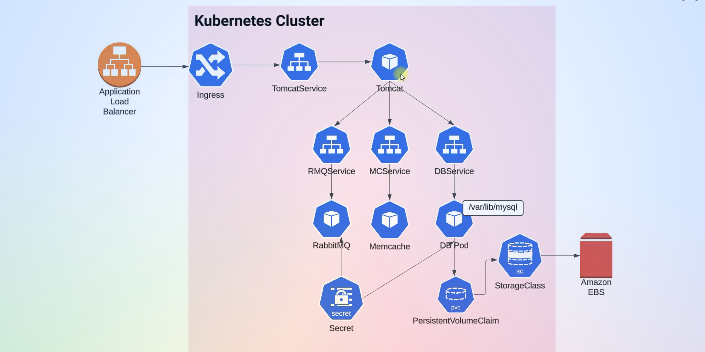
</p>

**Figure:** Full Kubernetes Deployment Flow (Ingress → Tomcat → Services → DB + Cache + MQ)

---

## 🔧 Step-by-Step Deployment Walkthrough

Each stage below contains the corresponding snapshot, YAML file references, and explanation.

---

### **1. Clone Repository**

**File:** `git clone https://github.com/Maazk111/kube-vpro-app.git`

<p align="center">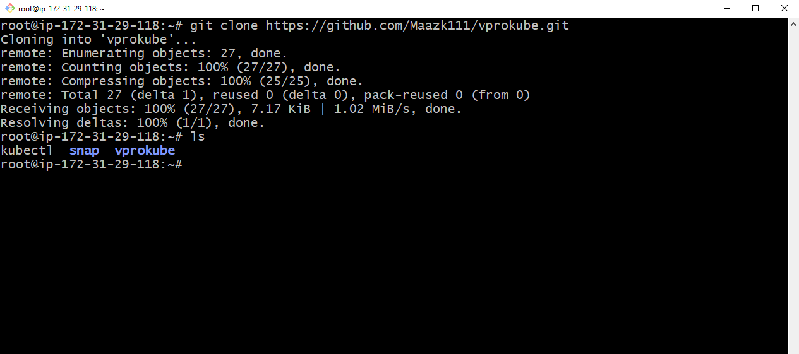</p>
The vProKube repository is cloned locally containing all Kubernetes manifests (`appdeploy.yaml`, `dbpvc.yaml`, `rmqservice.yaml`, etc.).

---

### **2. Verify Kops Cluster on AWS**

<p align="center">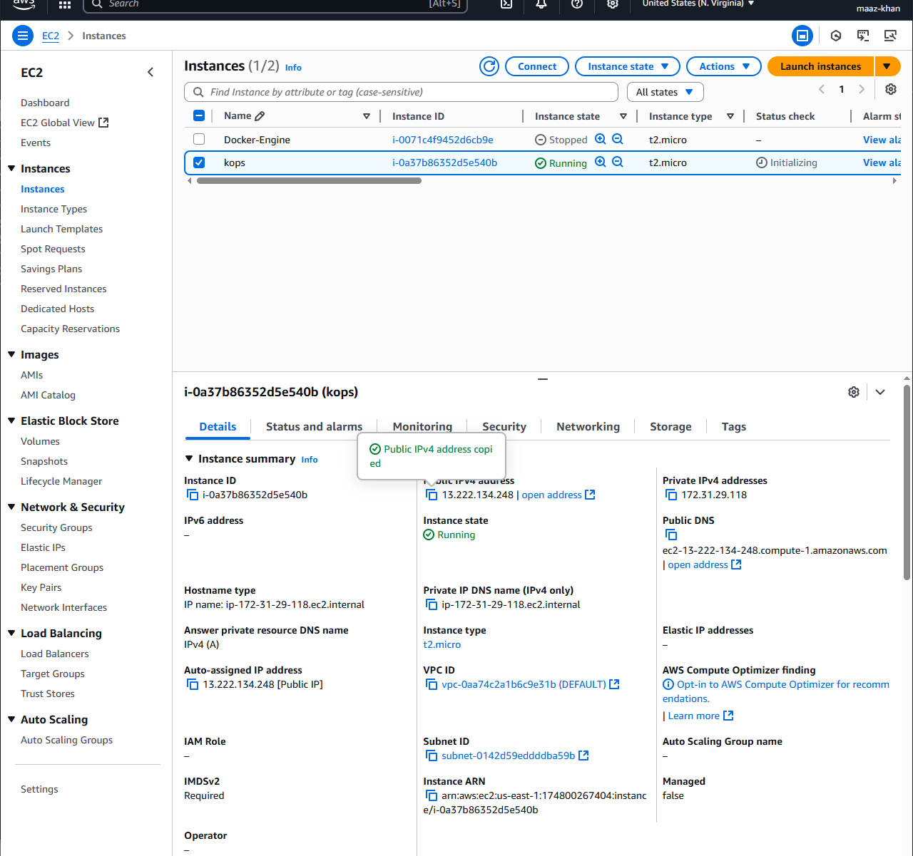</p>
Kops EC2 instance is active, confirming that the Kubernetes control plane is provisioned successfully.

---

### **3. Install and Verify NGINX Ingress Controller**

**Command:**

```bash
kubectl apply -f https://raw.githubusercontent.com/kubernetes/ingress-nginx/main/deploy/static/provider/aws/deploy.yaml
```

<p align="center">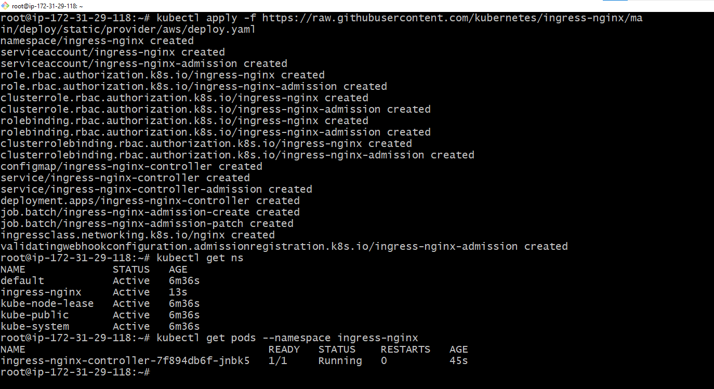</p>
The ingress controller is installed under the `ingress-nginx` namespace and validated using `kubectl get ns` and `kubectl get pods -n ingress-nginx`.

---

### **4. AWS Load Balancer Provisioning**

<p align="center">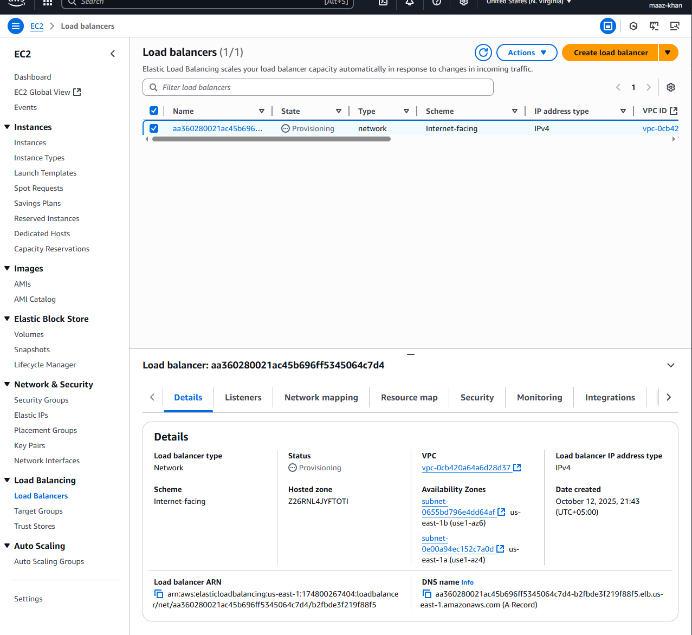</p>
AWS ALB automatically created for ingress routing. The load balancer is configured as **internet-facing**.

---

### **5. Verify Nodes and Create Persistent Volume Claim (PVC)**

**File:** `dbpvc.yaml`

<p align="center">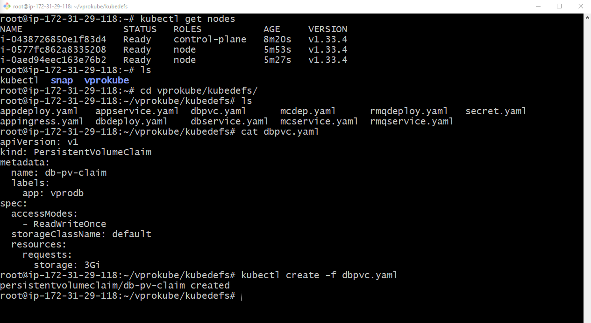</p>
Nodes are verified with `kubectl get nodes` and PVC is created for the MySQL pod requesting 3Gi storage.

---

### **6. Persistent Volume Bound to AWS EBS**

<p align="center">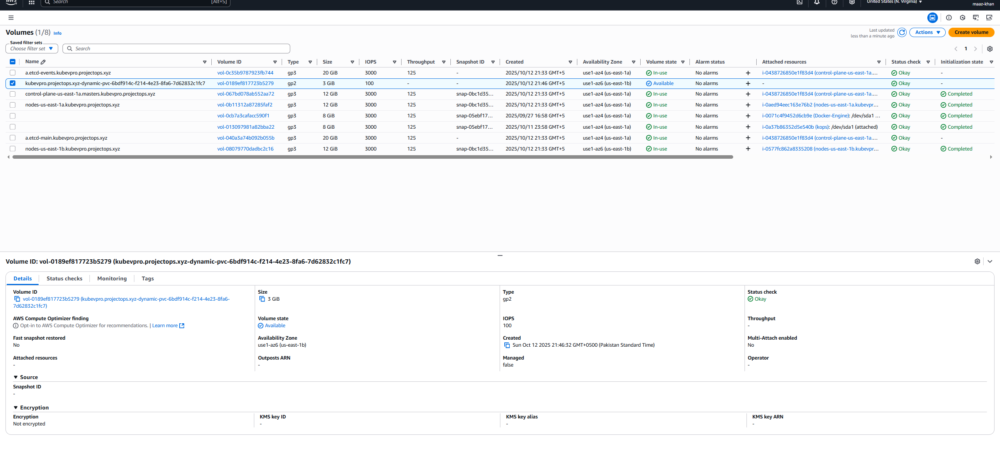</p>
EBS volume is dynamically provisioned and bound to the PVC. This ensures database persistence even after pod restarts.

---

### **7. Deploy Applications and Verify Services**

**Files:** `appdeploy.yaml`, `dbdeploy.yaml`, `mcdep.yaml`, `rmqdeploy.yaml`

<p align="center">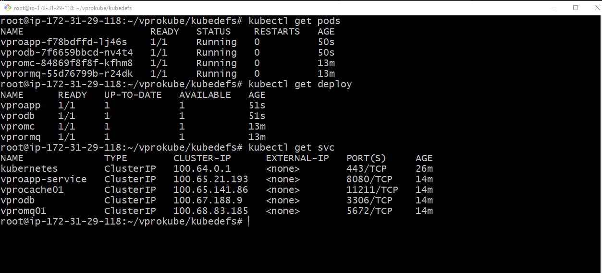</p>
All app components (Tomcat, DB, Memcache, RabbitMQ) deployed and validated using `kubectl get pods`, `get deploy`, and `get svc`.

---

### **8. Describe Application Pod and Service**

**File:** `appservice.yaml`

<p align="center">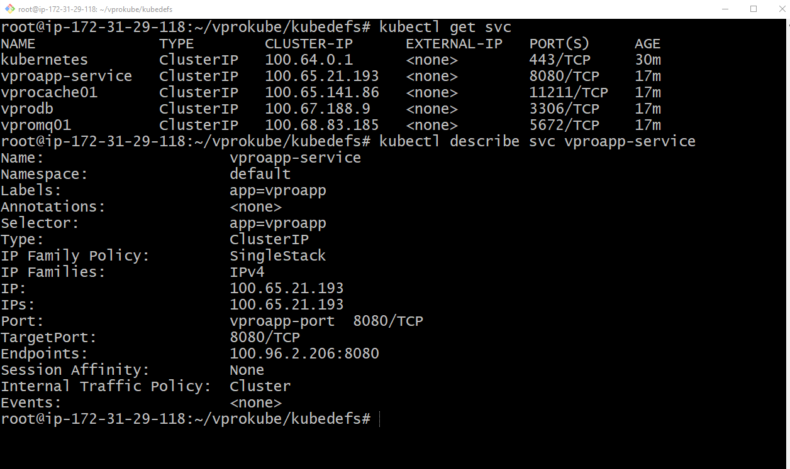</p>
The app service `vproapp-service` details are displayed showing internal ClusterIP and backend port mapping (8080/TCP).

---

### **9. Check PVC and Ingress Resources**

**Files:** `dbpvc.yaml`, `appingress.yaml`

<p align="center">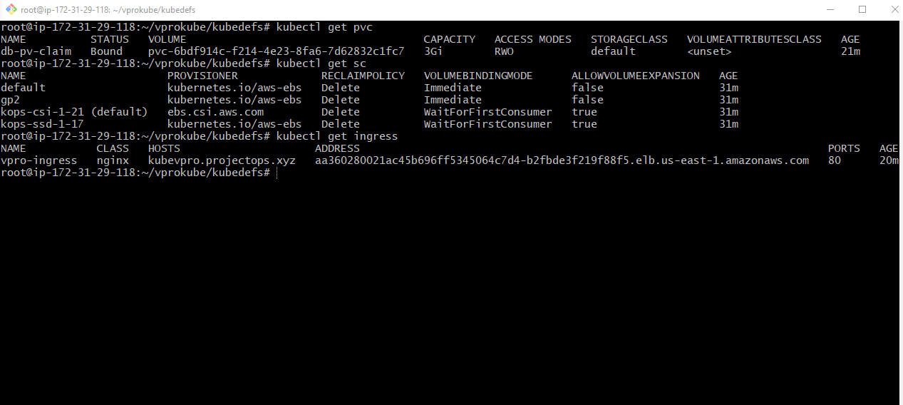</p>
PVC status confirmed as `Bound` and ingress resource created with DNS host mapping.

---

### **10. Validate ALB Address and Ingress Description**

<p align="center">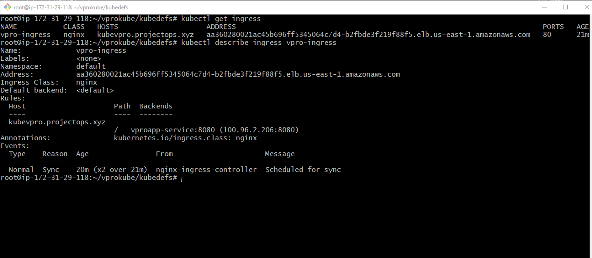</p>
Ingress successfully linked to the AWS ALB. Host `kubevproapp.projectops.xyz` points to backend service `vproapp-service`.

---

### **11. Application Login Page Accessible**

<p align="center">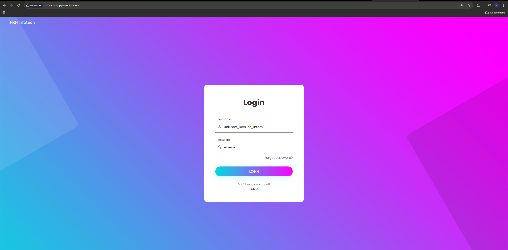</p>
The vProfile web application is live and accessible via ingress domain. The login page confirms successful frontend deployment.

---

### **12. Database Layer Validation**

<p align="center">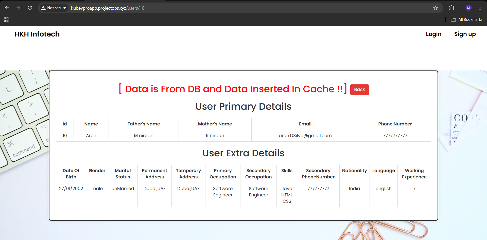</p>
Data retrieved from the **MySQL database**, also inserted into the cache (Memcached). Indicates DB connectivity and caching integration.

---

### **13. Cache Layer Validation**

<p align="center">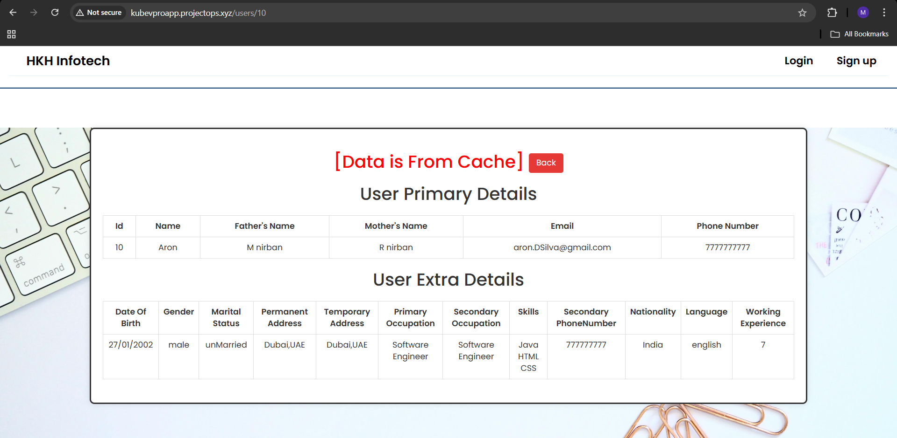</p>
Application retrieves data directly from **cache**, confirming cache hit and improved performance.

---

### **14. RabbitMQ Messaging Verification**

<p align="center">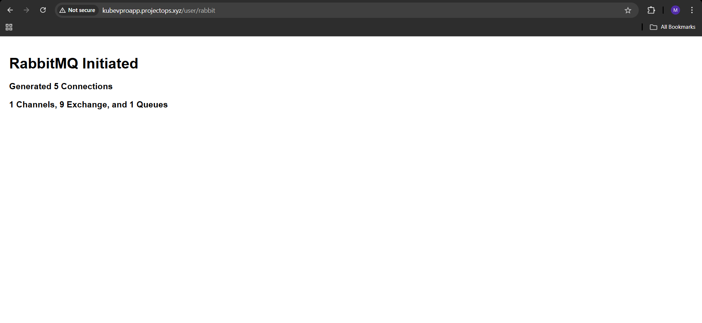</p>
RabbitMQ service initiated with active channels, exchanges, and queues — verifying backend messaging functionality.

---

## 🔒 Security Notice

All **Kubernetes clusters**, **AWS EC2 instances**, **Load Balancers**, and **EBS volumes** shown in this repository were **temporary lab resources** created for **educational and demonstration purposes** only.

- All **cloud resources were deleted** after successful validation.
- Any visible **IP addresses**, **DNS names**, or **hostnames** are **inactive**.
- Sensitive identifiers such as **AWS Account IDs**, **VPC/Subnet IDs**, and **ARNs** were **redacted or masked** to maintain security hygiene.

🧩 This ensures the project remains both **educational** and **secure**.
